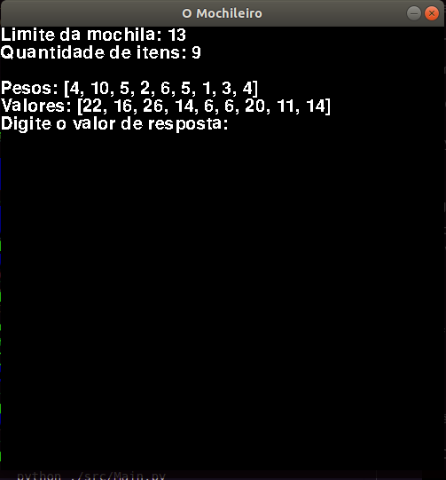
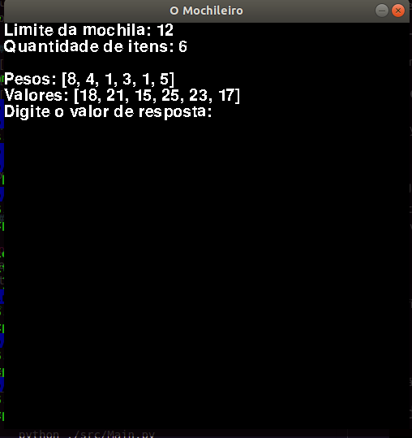
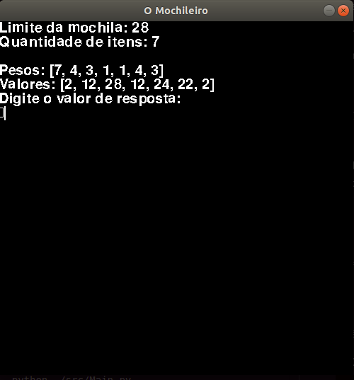

# Closest Pair

**Número da Lista**: 13<br>
**Conteúdo da Disciplina**: Programação Dinâmica<br>

## Alunos
|Matrícula | Aluno |
| -- | -- |
| 16/0124778  |  Ian Pereira de Sousa Rocha |
| 15/0135521  |  Leonardo da Silva Santos Barreiros |

## Sobre
<p align="justify">O programa Mochileiro é um jogo no qual o usuário passará por diferentes níveis de dificuldade sempre tendo que acertar qual o valor máximo de itens que vai pra dentro da mochila baseado nos seus pesos.

## Screenshots




## Requisitos

``` sh
Python 3.7+

```

``` sh
Pygame 2.0.1
```

Ao final para rodar o jogo basta rodar o seguinte comando:

``` sh
python ./src/Main.py
```

Então o jogo irá iniciar.


## Vídeo
[](https://youtu.be/sN-yK2ggl2M)